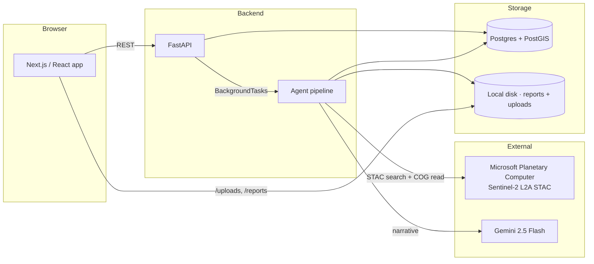
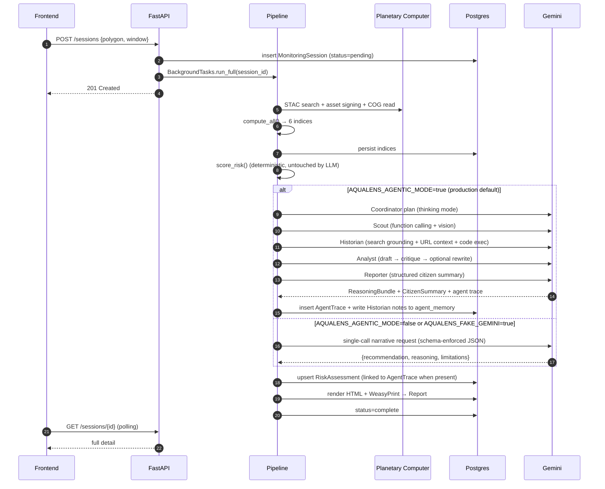
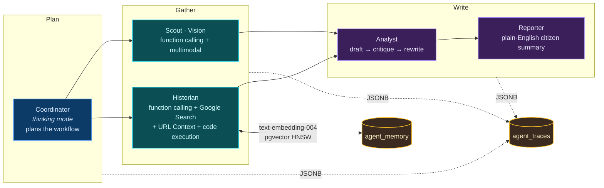
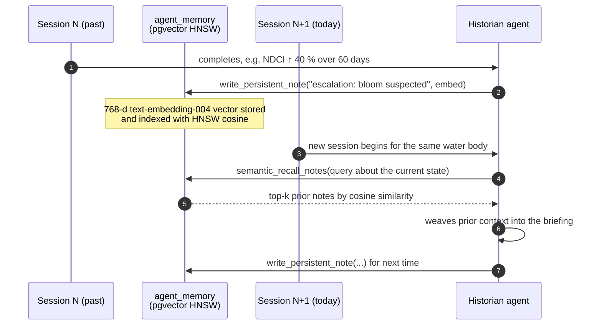

# Architecture

AquaLens is a small monorepo with three pieces: a FastAPI backend, a
Next.js frontend, and a Postgres + PostGIS database. Everything runs on
free-tier services and can be lifted onto any provider.

## Backend modules

| Module | Responsibility |
| --- | --- |
| `app.core.config` | Pydantic-settings env loader. |
| `app.core.database` | SQLAlchemy engine, session factory. |
| `app.core.tasks` | `JobRunner` protocol + `InProcessJobRunner` wrapping `BackgroundTasks`. |
| `app.models.*` | SQLModel tables for water bodies, sessions, indices, evidence, risk assessments, reports. |
| `app.schemas.*` | Pydantic v2 request/response DTOs. |
| `app.services.satellite.*` | Provider protocol + Planetary Computer impl + offline sample impl + factory. |
| `app.services.indices` | Pure numpy band math for six indices. |
| `app.services.risk_model` | Deterministic weighted score, level, urgency. |
| `app.services.reasoning` | Gemini 2.5 narrative with strict JSON schema. |
| `app.services.evidence_handler` | EXIF-stripping photo uploads. |
| `app.services.report_generator` | Jinja2 + WeasyPrint PDF rendering. |
| `app.services.pipeline` | Orchestrates the agent graph end-to-end. |
| `app.api.v1.endpoints.*` | Public REST handlers. |
| `app.utils.*` | GeoJSON helpers, matplotlib chart SVGs, WeasyPrint wrapper. |

## Frontend modules

| Module | Responsibility |
| --- | --- |
| `app/(marketing)/*` | Landing, methodology, limitations, about, changelog. |
| `app/(app)/*` | Dashboard, monitor, sessions, water bodies, settings. |
| `components/ui/*` | shadcn primitives tuned to brand tokens. |
| `components/chrome/*` | Top nav, sidebar, command palette, theme toggle, footer. |
| `components/marketing/*` | Hero, workflow scrollytell, agent-surface deep dive, indices showcase, citations marquee, CTA. |
| `components/map/*` | MapLibre wrapper, basemap switcher, place / coordinate search, mini-map preview. |
| `components/session/*` | New-session wizard, risk badge, risk card, index grid/table, scene metadata, processing skeleton, agent trace, analysis summary, session card. |
| `components/evidence/*` | Field evidence form, evidence list. |
| `components/report/*` | PDF download button. |
| `lib/*` | API client, types, query client, design tokens, env, format, geo, SEO. |
| `hooks/*` | TanStack Query hooks for sessions, water bodies, evidence. |

## Agent pipeline

## Agent layer

The agent layer is a separate package (`backend/app/services/agent/`)
that runs only when both `AQUALENS_AGENTIC_MODE=true` and a Gemini
API key are configured. It plugs into `services/pipeline.py` at the
narrative step and persists two things alongside the existing
`RiskAssessment` row:

- **`agent_traces`** — JSONB log of the Coordinator plan, every
  sub-agent's tool calls, token usage, and latency. One row per
  session.
- **`agent_memory`** — Historian-written distilled observations
  scoped per water body. Each row carries a 768-dim
  `text-embedding-004` vector so future Historian runs can recall
  semantically related notes, not just the most recent ones. On
  Postgres a `pgvector(768)` mirror column + HNSW cosine index makes
  this fast; on SQLite the Python similarity path runs the same
  ranking in user space.

### Cross-session memory loop

The same Historian agent both *reads* prior memory at the start of a
new session and *writes* a fresh distilled observation at the end.
That continuity is what lets the agent layer genuinely manage
multi-step work over time instead of acting as a stateless chatbot.

Full per-agent specs, tool inventories, and failure-handling rules
live in [`docs/agent_layer.md`](agent_layer.md).

## Data flow guarantees

- The deterministic risk score is computed before any LLM call. The LLM
  cannot move a session up or down a risk band.
- Imagery is streamed; AquaLens never persists raw GeoTIFFs. Only the
  derived numeric indices and provider metadata land in the database.
- Photos uploaded with evidence are stripped of EXIF (including any
  embedded GPS) before being written to disk.
- Every report contains the advisory disclaimer in two places (top
  banner and footer); the same text appears on the in-browser report
  view.
